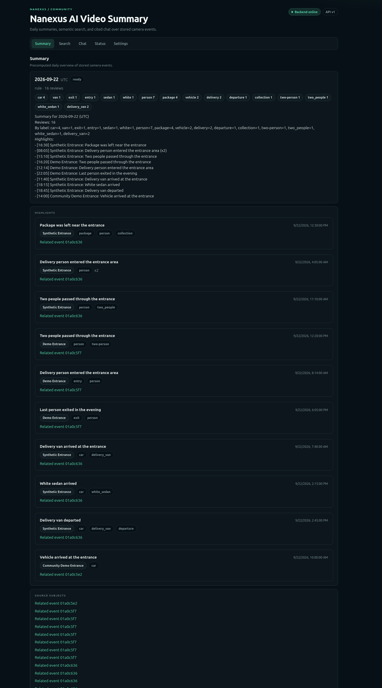
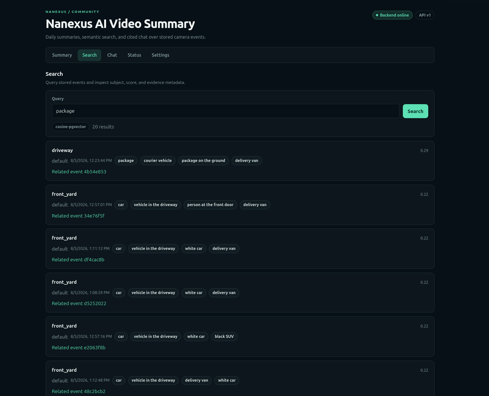
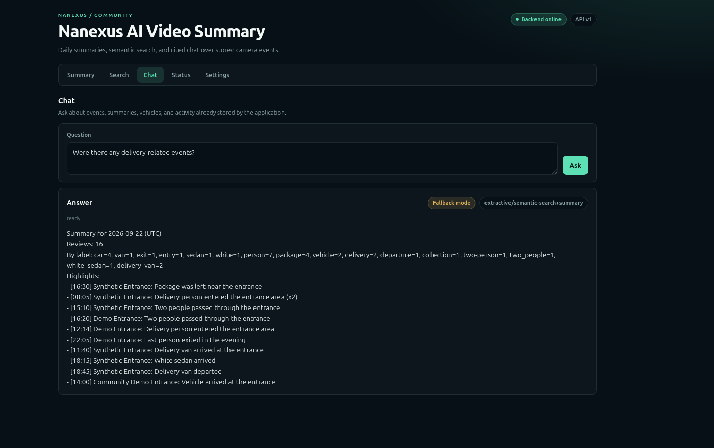

# Nanexus AI Video Summary

Nanexus AI Video Summary turns camera and video-security events into searchable, summarizable, and traceable information.

Its goal is to move beyond traditional monitoring workflows centered on raw video timelines, playback, and isolated alerts. It organizes normalized events into daily summaries, semantic search results, and cited conversational answers, while preserving links back to the underlying subjects and evidence. This reduces the amount of manual video review needed to understand what actually happened.

The application is designed to sit above camera, NVR, and VMS systems so higher-level clients can work with normalized events instead of being tied directly to one recorder, camera vendor, or proprietary platform API.

Video Summary is built on **[Nanexus Event Intelligence](https://github.com/Nanexus-AI/nanexus-event-intelligence)**, a separate vendor-neutral and platform-neutral event-processing middleware project.

Video Summary consumes Event Intelligence through its public HTTP/v1 contracts and owns the application API, retrieval and summary data, background workers, and Web and Android client experiences.

Event Intelligence also has value independently of Video Summary: its normalized event model and stable public contracts can support other higher-level applications without requiring each application to integrate separately with individual camera, NVR, or VMS platforms.

This repository contains verified backend, Web, Android, deterministic Stub, Linux CPU OpenCLIP, and containerized GPU/CUDA OpenCLIP paths.

Legacy compatibility paths are still retained. The Web and Android clients are currently **functional reference interfaces**, not finished productized UI/UX.

The project should not be treated as a turnkey production system or a complete public-internet deployment.

## Application preview

The current Web interface demonstrates the three main application workflows: daily event summaries, semantic search, and grounded chat over stored event data.

### Summary

The Summary view turns normalized event activity into a daily operational overview with label counts, highlights, and traceable source subjects.



*Shown with fully synthetic demo data.*

### Semantic Search

The Search view retrieves semantically related events using persisted embeddings and pgvector-backed cosine search, while preserving subject metadata and related-event links.



*Shown with fully synthetic demo data.*

### Chat

The Chat view answers questions using stored summaries and semantic search results. In the current reference implementation, extractive fallback mode remains available when no external LLM is configured.



*Shown with fully synthetic demo data.*

## Architecture

```text
Camera / NVR / VMS
        |
        v
Nanexus Event Intelligence
  vendor-neutral event processing and public HTTP/v1 contracts
        |
        v
Nanexus AI Video Summary
  ingestion consumers, retrieval, summaries, chat, application API
        |
        +--> Web
        +--> Android
        +--> Summary
        +--> Search
        +--> Chat                                                                                                                   Web and Android connect to the Video Summary API.
```

Video Summary should consume Event Intelligence through its versioned public boundary rather than importing its source, sharing its database, or reaching directly into a camera system.

Frigate is an important current integration and compatibility path, but it is not the application's permanent architectural boundary.

See the current architecture notes for more detail.

Current capabilities

Event processing: consumes versioned Event Intelligence events, evidence, enrichment jobs, and compatibility metadata through HTTP/v1 clients and workers. A legacy Frigate MQTT/import path remains available as a rollback and local-demo path.

Search: provides legacy keyword fallback and the v1 Search API backed by persisted embeddings and worker-isolated model inference. Semantic retrieval uses stable subject UUIDs and can report degraded results.

Summaries: precomputes versioned daily summaries from Event Intelligence data. Deterministic rule mode is the default; an optional budget-limited OpenAI-compatible LLM mode is available.

Chat: provides asynchronous v1 chat jobs over stored Search and Summary data, with subject citations, ownership isolation, prompt-injection controls, and an extractive no-cloud fallback.

Model processing: supports deterministic Stub processing and an isolated OpenCLIP provider for image/text embeddings and zero-shot labels. Model inference is kept out of the application API process.

Clients: the React Web client and Jetpack Compose Android client negotiate v1 capabilities and expose Summary, Search, and asynchronous Chat. Android also retains the Timeline compatibility view.

Compatibility: startup capability checks can reject incompatible Event Intelligence API, schema, processor-contract, or capability versions. Legacy APIs and clients remain available as explicit rollback paths during the initial release period.

These capabilities have clean-candidate verification evidence, including:

synthetic public-HTTP integration with Event Intelligence;

real CPU OpenCLIP inference;

real GPU/CUDA OpenCLIP inference;

persisted embeddings and semantic retrieval;

grounded Summary/Search/Chat application flows.

Deployment-specific production hardening, packaging, and publication remain separate work.

Safe local demo

This small demo uses synthetic events, local snapshots, the deterministic Stub vision pipeline, and loopback-bound PostgreSQL, Redis, and MQTT.

It does not require:

a camera;

model downloads;

a GPU;

a cloud API key.

The demo exercises the retained local-compatible path.

The full v1 integrated workflow uses Nanexus Event Intelligence and is documented separately as release guidance matures.

Prerequisites:

Python 3.12

Docker

Docker Compose

Copy .env.example, select Stub mode, and start the local infrastructure:

cp .env.example .env
printf '\nAI_MODE=stub\n' >> .env
docker compose up -d
python3.12 -m venv .venv
source .venv/bin/activate
python -m pip install -e .

In three terminals, with the virtual environment activated, run:

python -m services.mqtt_listener.main
python -m services.ai_worker.main
uvicorn services.api.main:app --reload --host 127.0.0.1 --port 8000

Then publish deterministic sample events and inspect the API:

source .venv/bin/activate
python scripts/seed_events.py
python scripts/build_summary.py
curl -s http://127.0.0.1:8000/timeline | python -m json.tool
curl -s http://127.0.0.1:8000/summary/today | python -m json.tool

Interactive API documentation is available at:

http://127.0.0.1:8000/docs

Local credentials and anonymous MQTT configuration are development-only. Keep this demo on the local machine or a trusted internal network.

Nanexus Event Intelligence

Nanexus Event Intelligence is a separate repository and service.

Normal deployments point EVENT_INTELLIGENCE_URL at a compatible running Event Intelligence service and communicate only through its public, versioned HTTP contracts.

A local Event Intelligence source checkout is not required for that mode.

For source-built integration and synthetic integration testing, the Compose files support an optional Event Intelligence checkout.

By default they look for a sibling directory named:

nanexus-event-intelligence

Set EVENT_INTELLIGENCE_SOURCE_DIR to use another layout:

EVENT_INTELLIGENCE_URL=http://event-intelligence:8000
EVENT_INTELLIGENCE_SOURCE_DIR=../nanexus-event-intelligence

The source directory is a build/test input only.

Video Summary runtime code does not:

import Event Intelligence source;

share the Event Intelligence database.

See Architecture for the compatibility boundary.

OpenCLIP and resource use

The current OpenCLIP configuration is:

ViT-B-32-quickgelu

with pretrained identifier:

openai

Model weights are acquired on demand by the model tooling and cached locally.

They are not bundled with this repository.

Downloads and caches require local storage, and model processing can require significant memory and CPU resources.

Linux CPU OpenCLIP and the separate container-first CUDA/GPU profile:

openclip-cuda

docker/Dockerfile.model-worker-cuda

compose.gpu.yaml

have both been hardware-validated.

The default Linux installation still resolves Torch from the CPU wheel index.

GPU mode requires the host to provide:

an NVIDIA driver;

NVIDIA Container Toolkit.

A host CUDA toolkit is not required.

The project is currently distributed primarily as source. The repository does not include pretrained model weights, user camera media, or private environment configuration, and it does not currently provide project-published Docker images or APK/AAB binaries. Those build artifacts are produced locally from source.

See resource profiles for current planning details.

Web and Android

The Web client in web/ provides:

Summary

Search

Chat

against the Video Summary application API.

During Vite development, /api requests are proxied to:

http://localhost:8000

by default.

VITE_API_PROXY_TARGET can select another trusted-development API endpoint.

The currently validated Web toolchain uses Node:

22.14.0

The Android client in android/ provides:

Summary

Timeline

Search

Chat

Settings

Debug builds default to:

http://10.0.2.2:8000

which allows an Android emulator to reach an API running on its host.

A physical device needs a Video Summary API address reachable on the same trusted network.

Release builds require an HTTPS base URL and reject cleartext HTTP.

The validated Android toolchain is:

JDK 17

Gradle 8.9

Android Gradle Plugin 8.7.3

Kotlin 2.0.21

compile/target SDK 35

minimum SDK 26

See the Android development guide.

Security and deployment boundary

The default development deployment assumes a trusted internal network.

The following components must not be exposed directly to untrusted networks:

PostgreSQL

Redis

MQTT

workers

model services

middleware-facing services

Development credentials and anonymous MQTT are for local or trusted-development use only.

External access is the deployer's responsibility and should use controls appropriate to the environment, such as:

VPN

TLS reverse proxy

authentication gateway

zero-trust access layer

This repository does not provide a complete public-network security gateway.

Before moving beyond local development, review:

Deployment

Security

Potential vulnerabilities should be handled according to the conservative reporting process described in SECURITY.md.

Do not disclose sensitive security details publicly.

Documentation and license

Architecture

Development

Contributing

Deployment

Security

Android development

Resource profiles

Environment template

Apache License 2.0
